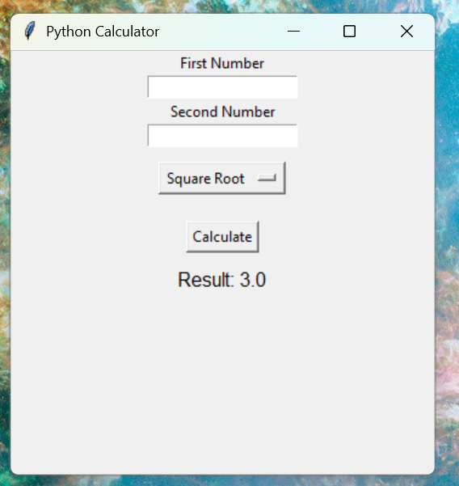
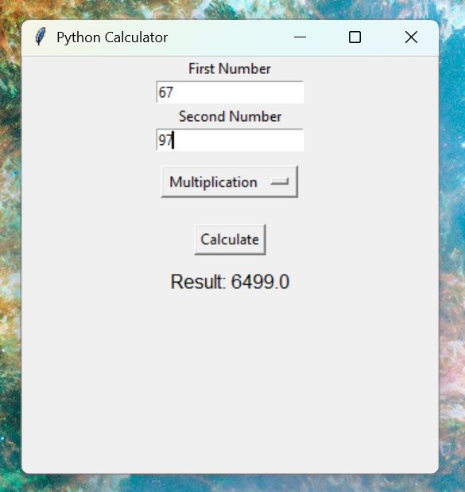

# Python Calculator

A simple calculator application developed using Python.

## Features
- Basic arithmetic operations
  - Addition
  - Subtraction
  - Multiplication
  - Division
- Command-line calculator
- GUI calculator using Tkinter
- User-friendly interface

## Technologies Used
- Python 3
- Tkinter

## Project Structure
```
python-calculator/
│── calculator.py
│── desktop_calculator.py
│── README.md
```

## How to Run

### Command-Line Calculator
```bash
python calculator.py
```

### Tkinter Desktop Calculator
```bash
python desktop_calculator.py
```

## Screenshots

### Command-Line Calculator


### Tkinter Desktop Calculator


## Future Improvements
- Scientific calculator
- Dark mode
- History feature
- Keyboard shortcuts

## Author
**M-Sonika**
